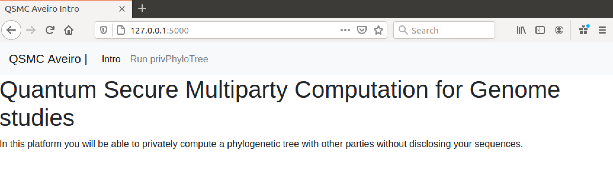
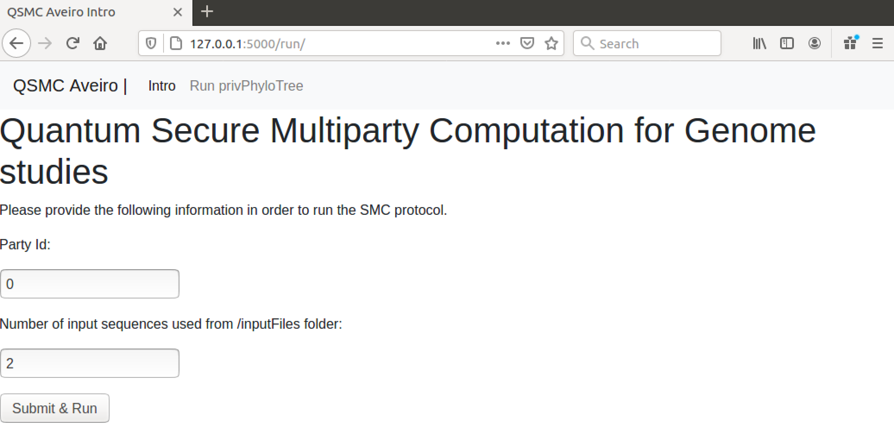
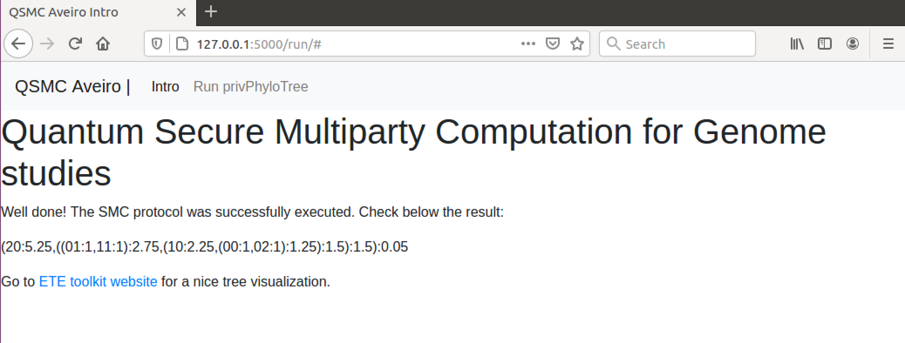

The UPGMA (**U**nweighted **p**air **g**roup **m**ethod with **a**rithmetic mean) algorithm is an hierarchical clustering method that is commonly used in genetics to create [Phylogenetic Trees](https://en.wikipedia.org/wiki/Phylogenetic_tree) of several DNA sequences.

Check a tutorial on how the UPGMA algorithm works in the following [youtube video](https://www.youtube.com/watch?v=09eD4A_HxVQ).

The system implemented is based on the paper [*Quantum Secure Multiparty Computation of Phylogenetic Trees of SARS-CoV-2 Genome*](link). In our scenario there are three parties (Alice, Bob and Charlie) who want to compute a phylogenetic tree from their COVID DNA sequences. As explained in the above paper, the private version of the UPGMA algorithm is divided in two phases: 

1. Privately compute hamming distance between every sequence (first phase);
2. Iteratively group the genes with the smallest differences between them (second phase).


## Project structure

The project (and each party) is structured as follows:

#### Directories

1. `boolCircuit`: 
	
	- `mainScapi.txt`: `.txt` file describing the boolean circuit of the Hamming distance functionality (as presented in [hammingDistance](../hammingDistance) folder). 

2. `include`:

	- `guide_tree.hpp`: header file of the second phase of UPGMA;
	- `HamParties.hpp`: header file of the first (private) phase of UPGMA. 
	- `matrixDist.hpp`: header file to build the matrix distance.

3. `inputFiles`: Input files with the following name structure `Party_ i_ seq_ j.txt` for party number i ≤ 3 and sequence j. Note that the strucutre of the input elements in this file should be as explained in [hammingDistance](../hammingDistance) section.

4. `partiesFiles`: one file with the ip numbers and ports of all the three parties. After the application is run it is created one file for each pair of parties. File name structure created: `Parties_i_j`, where i and j are the parties’ ids.

5. `phylogeneticTree`: empty folder where the final phylogenetic tree is saved with `.nwk` extension.

6. `quantum_oblivious_key_distribution`: emulator to generate oblivious keys to be used with the oblivious transfer functionality.

7. `results`: empty folder where the Hamming distances between sequences are saved. There are two name structures:

	- `out_myseq_i_otherparty_j_otherseq_k.txt`: where i denotes the current party’s sequence number, j denotes the other party id and k the other party’s sequence number. All the Hamming Distances between the current party and other parties have this structure (computed during QSMC phase and internal phase).
	- `out_party_l_seq_i_otherparty_j_otherseq_k.txt`: which saves the Hamming distance between party l ith sequence and party j kth sequence. This structure is used to save the hamming distances that are not related with the current party’s sequences (distributed during the QKD phase).

8. `src`:
	
	- `guide_tree.cpp`: source file of the second phase of UPGAM.
	- `HamParties.cpp`: source file of the first (private) phase of UPGAM.
	- `matrixDist.cpp`: source file to build the matrix distance from the computed hamming distances.

9. `yaoConfigFiles`: before the application is run the folder is empty. After it is run it is created one configFile for each input sequence. These files contain the information of the paths to the boolean circuit and input elements.

10. `templates`: the tamplates used for the web application built in Flask.

#### Application

1. `App.cpp`: Application source file with main function. This main function is divided as follows:

	- Each party computes the hamming distance between the several parties (First phase - private):
		
		- Sends and receives the number of inputs to/from the other parties;
		- Computes Hamming Distance using SMC between parties’ sequences;
		- Evaluators send SMC result to Garbler and Garlber receives it;
		- Computes interanlly the hamming distances between their own sequences;
		- Sends all the distances not known by the other parties.

	- Create Hamming Distance Matrix. This matrix has the following structure for the scenario where Alice has three sequences, Bob has two and Charlie one sequence:

where ij denotes the sequence j owned by party i. Inside each cell have the hamming distance between the corresponding column and row sequences.
	
	- Internally compute the second phase of UPGMA algorithm.


2. `runSMCParty.sh`: shell script used inside [`HamParties.cpp`](src/HamParties.cpp) file in order to run the Hammind Distance SMC protocol between two parties.

3. `makefile`: file used to compile the project.

4. `runUPGMA`: execultable created after running `make` command. The executable needs two inputs: party id and number of inputs. *Example*:
```
$ ./runUPGMA 0 2
```
It runs the application as party id 0 and two inputs. **Note:** here the application will only use the input files `Party_0_ seq_0.txt` and `Party_0_ seq_1.txt` even if the corresponding input's folder has more input files.

5. `webapp.py`: Flask web application.


## Execution

### Building process

After installing [libscapi](../INSTALLlibscapi.md) and [mpc-benchmark](../INSTALLmpcbenchmark.md), we simply have to run inside the party folder:
```
$ make
```

Now, we can either run the application through the terminal or using `webapp.py` Flask application.

### Terminal

1. Ensure the file `partiesFiles/Parties` have the following structure:
```
party_0_ip = 127.0.0.1
party_1_ip = 127.0.0.1
party_2_ip = 127.0.0.1
party_0_port = 8000
party_1_port = 8200
party_2_port = 8400
```

*Non-local run:* provide the corresponding IP addresses of the parties.

2. Place the desired sequences inside the folder `inputFiles` with the name structure described above.

3. Run in separate terminals the application `./runUPGMA` providing the party id and the number of input sequences: 
```
$ ./runUPGMA 0 2 
$ ./runUPGMA 1 3 
$ ./runUPGMA 2 1
```

In the presented example Alice has id 0, Bob id 1 and Charlie has id 2.

4. The output result is saved inside phylogeneticTree folder. In order to better visualize the tree you can go to [this website](http://etetoolkit.org/treeview/).


### Flask application

Please make sure you have Flask python package installed in your machine. See [here](https://flask.palletsprojects.com/en/1.1.x/installation/) the docs to install Flask.


1. Launch Flask application:
```
$ python webapp.py
```

2. Open web browser with `http://127.0.0.1:5000`.



3. Go to *Run privPhyloTree* tab and type the Party Id value and sequences number.



4. The solution is presented in newick format.




