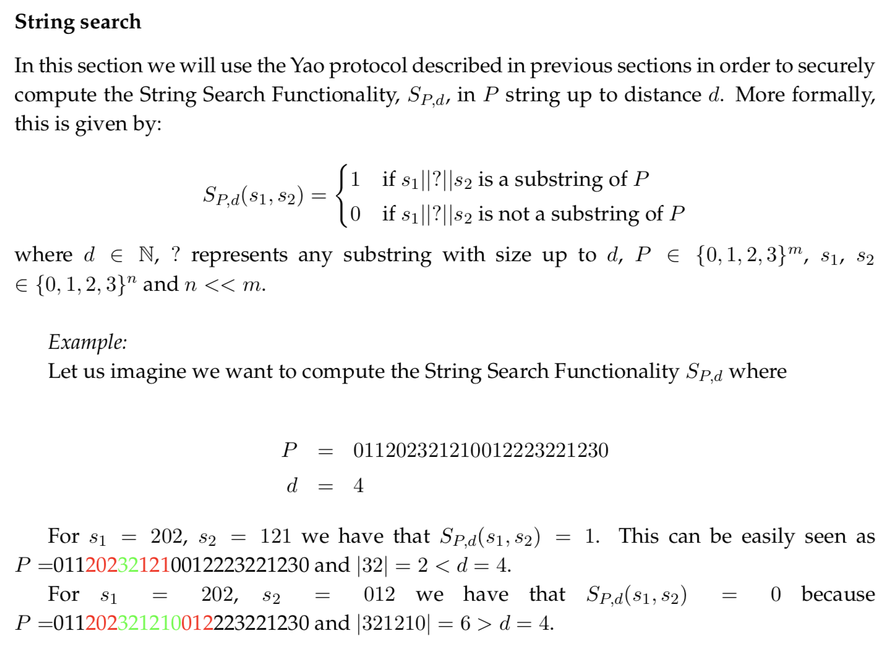

Here we will explain how to integrate the already installed tools (libscapi, mpc-benchmark and cbmc-gc) in order to execute a secure computation of the string search functionality. 

The String search functionality is given as follows:

The flow of the final program is described in the picture below

We start from writing a ANSI-C program with the desired functionality to be computed and save it as `main.c`. The input values of the functionality
