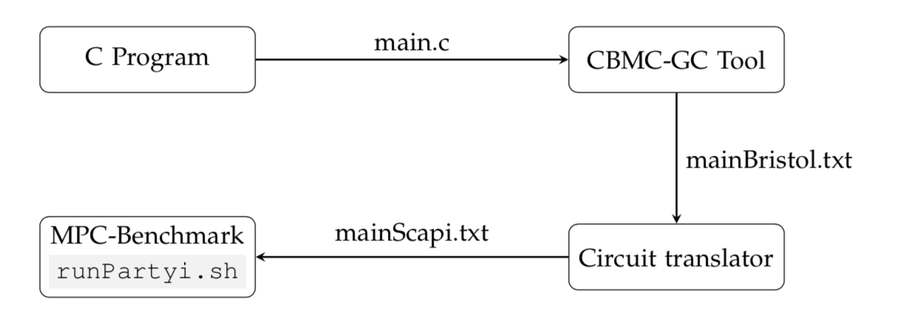

Here we will explain how to integrate the already installed tools (libscapi, mpc-benchmark and cbmc-gc) in order to execute a secure computation of the string search functionality. This functionality is briefly explained in [stringSearchFunctionality.pdf](stringSearchFunctionality.pdf) along with some examples. 

The flow of the final program is described in the picture below

We start from writing a ANSI-C program with the desired functionality to be computer and save it as `<main.c>`
